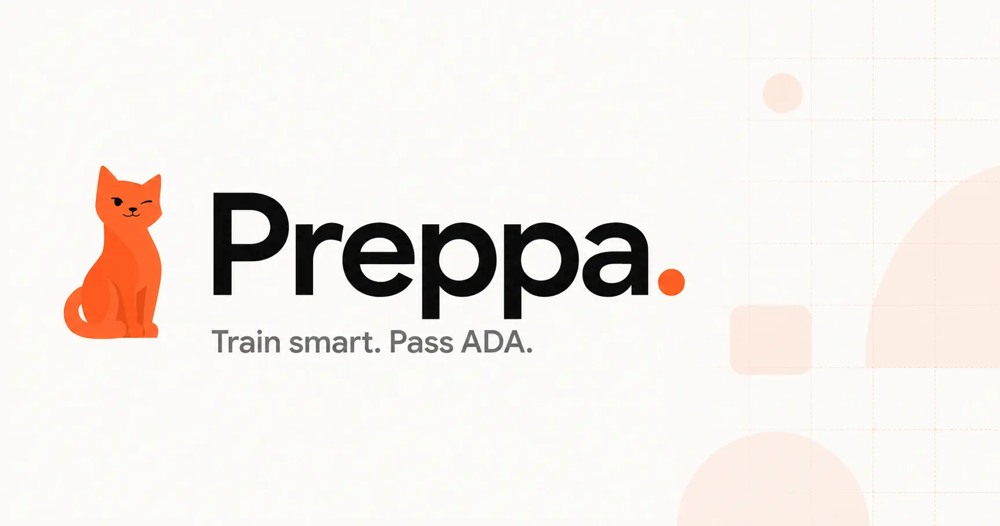

# Preppa

**The prep tool ADA never gave you.**

Indonesian students applying to ADA face three real problems: no structured prep, no pressure training, and no feedback loop when they get something wrong. Preppa fixes all three.

---

## Features

**Practice Mode** — Answer one question at a time. Get instant AI feedback on every mistake. Wrong answers are saved to your flashcard deck automatically.

**Test Mode** — No hints. No XP. Just a timer and the questions — exactly like the real thing. Review your weaknesses after you submit.

**Smart Flashcards** — Every wrong answer in Practice Mode becomes a flashcard. Work through your deck until it's empty.

**Readiness Score** — One number that tracks your accuracy, test performance, and streaks. It updates after every session. You'll want to watch it climb.

---

## Tech Stack

| Layer | Choice |
|---|---|
| Frontend | Next.js, Tailwind CSS, Framer Motion |
| Backend & Auth | Firebase (Firestore, Auth) |
| AI | Gemini API |
| Deployment | Google Cloud Run |

---

## Getting Started

```bash
git clone <your-repo-url>
cd preppa
npm install
```

Create a `.env.local` file:

```env
NEXT_PUBLIC_FIREBASE_API_KEY=
NEXT_PUBLIC_FIREBASE_AUTH_DOMAIN=
NEXT_PUBLIC_FIREBASE_PROJECT_ID=
NEXT_PUBLIC_FIREBASE_STORAGE_BUCKET=
NEXT_PUBLIC_FIREBASE_MESSAGING_SENDER_ID=
NEXT_PUBLIC_FIREBASE_APP_ID=

GEMINI_API_KEY=
```

```bash
npm run dev
```

Open [http://localhost:3000](http://localhost:3000).

---